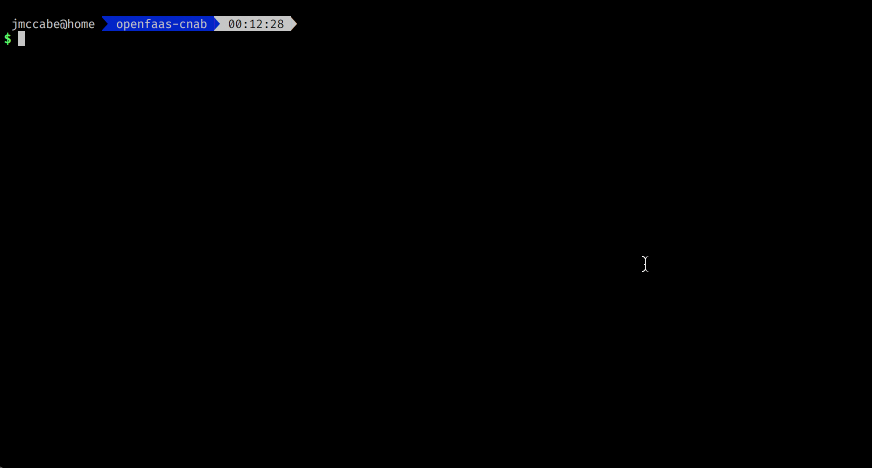

# OpenFaaS on Swarm

This bundle packages up [OpenFaaS](https://github.com/openfaas/faas) for Docker Swarm.

It demonstrates the following [CNAB Bundle](https://github.com/deislabs/cnab-spec/) and [duffle](https://github.com/deislabs/duffle) features.

- Packaging a Docker Stack
- Using credentials
- Passing parameters to duffle.

## Prerequisites

- Install [Duffle](https://github.com/deislabs/duffle).
- Docker running in Swarm mode.

## Building the CNAB Bundle

- Clone this repo and `cd` into it.

      git clone https://github.com/deislabs/example-bundles.git
      cd bundles/openfaas

- Build the CNAB bundle with `duffle`

      duffle build

## Installing OpenFaaS from CNAB Bundle

- Create Basic Auth credentials used to secure the API/UI (note that other mechanisms for securing OpenFaaS exist, I'm just including the basic option at the moment).

      duffle creds generate dev-creds johnmccabe/openfaas:0.9.11

- Install OpenFaaS (you can optionally disable auth by passing `--set basic_auth=false` to `duffle install`)

      duffle install openfaas johnmccabe/openfaas:0.9.11 -c dev-creds

- View the installed app and check the status of OpenFaaS

      duffle list
      duffle status openfaas -c dev-creds

- You can now proceed to login and use OpenFaaS (see the [docs](https://docs.openfaas.com) for guidance)

      faas login
      faas store deploy figlet
      echo HelloWorld | faas invoke figlet
